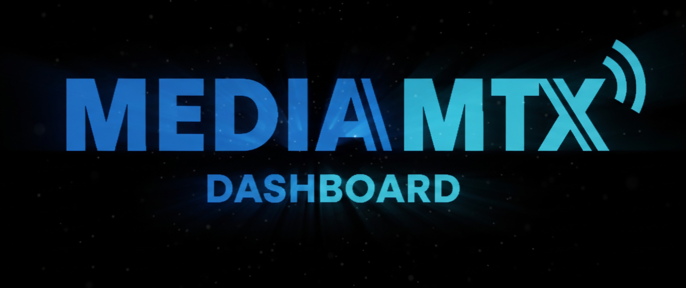

<p align="center">
  <a href="https://github.com/thanthienhai/MTX-UI">
    
  </a>
</p>

<p align="center">
  A modern web interface for the <a href="https://github.com/bluenviron/mediamtx">MediaMTX</a> media server.
</p>

<p align="center">
  <a href="https://github.com/thanthienhai/MTX-UI/stargazers"></a>
  <a href="https://github.com/thanthienhai/MTX-UI/network/members"></a>
  <a href="https://github.com/thanthienhai/MTX-UI/issues"></a>
  <a href="https://github.com/thanthienhai/MTX-UI/blob/main/LICENSE"></a>
  <br>
  <a href="https://thanthienhai.github.io/MTX-UI/"></a>
  <a href="https://github.com/thanthienhai/MTX-UI/discussions"></a>
  <a href="https://github.com/thanthienhai/MTX-UI/wiki"></a>
  <br>
  <a href="https://github.com/thanthienhai/MTX-UI/actions"></a>
  
  
</p>

---

**MediaMTX Dashboard** is a powerful, user-friendly web interface designed to simplify the management and monitoring of your [MediaMTX](https://github.com/bluenviron/mediamtx) streaming infrastructure. It provides an intuitive UI, real-time updates, and modular components for extensibility.

## ✨ Features

- **🖥️ Intuitive Dashboard**: Get a clear overview of your streaming server's status and health.
- **📡 Stream Management**: Easily add, configure, and monitor RTSP, RTMP, HLS, and WebRTC streams.
- **📊 Real-time Metrics**: Visualize key performance indicators like bitrate, connected clients, and protocol usage.
- **⚙️ Configuration Management**: Edit `mediamtx.yml` settings directly from the web interface.
- **🐳 Easy Deployment**: Run the dashboard locally with `pnpm` or deploy it using the provided Docker configuration.

## 🚀 Getting Started

### Prerequisites

- **Node.js** (Latest LTS version recommended)
- **pnpm**: Install via `npm install -g pnpm`
- **Docker** (Optional, for containerized workflows)

### Installation

1. **Clone the repository:**

```bash
git clone https://github.com/thanthienhai/MTX-UI.git
cd MTX-UI
```

2. **Install dependencies:**

```bash
pnpm install
```

## Running the Project

### Local Development

Start the development server with hot-reload:

```bash
pnpm dev
```

### Using Docker Compose

For a containerized local environment:

1. Create a `.env.local` file with your MediaMTX configuration.

2. Start the publisher service:

```bash
docker-compose up publisher -d
```

3. Build and run the dashboard:

```bash
pnpm run build
pnpm run dev
```

## Production Deployment

Build and run with the production Docker Compose configuration:

```bash
docker-compose -f docker-compose.prod.yml up --build
```

Alternative Dockerfiles are available for different environments (Dockerfile, Dockerfile.dev, Dockerfile.simple, Dockerfile.debian).

## 📚 Documentation

For detailed information, please refer to the following resources:

- Wiki: Comprehensive guides on configuration, deployment, and troubleshooting.  
- Discussions: Ask questions, share ideas, and get support from the community.  
- Open Collective: Support the project and its ongoing development.

## 🛠️ Tech Stack

The dashboard is built with a modern, scalable set of technologies:

- TypeScript (79%): Provides strongly-typed, maintainable code for the core application logic.  
- Next.js: A React-based framework for server-side rendering (SSR) and static site generation (SSG).  
- pnpm: The package manager for efficient workspace and monorepo management.  
- Docker: Multiple Dockerfiles and Compose files are provided for containerized development and production deployments.  
- PostCSS: For advanced CSS processing.

## 🤝 Contributing

We welcome contributions from the community! To get started:

1. Fork the repository.  
2. Create a feature branch: `git checkout -b feature/amazing-feature`  
3. Commit your changes: `git commit -m 'Add some amazing feature'`  
4. Push to the branch: `git push origin feature/amazing-feature`  
5. Open a Pull Request.

Please see [CONTRIBUTING.md file](CONTRIBUTING.md).

Please ensure your code adheres to the existing style and includes appropriate tests.

## 💬 Support and Community

· GitHub Issues: Report a bug or request a feature  
· GitHub Discussions: Join the conversation  
· Project Wiki: Browse the documentation  
· Open Collective: Sponsor the project

## 📄 License

Distributed under the MIT License. See LICENSE for more information.

---

<p align="center">
  Made with ❤️ by <a href="https://github.com/thanthienhai">SIPVY</a> Thân Thiện and the community.<br>
  <i>Not officially affiliated with the MediaMTX project.</i>
</p>
